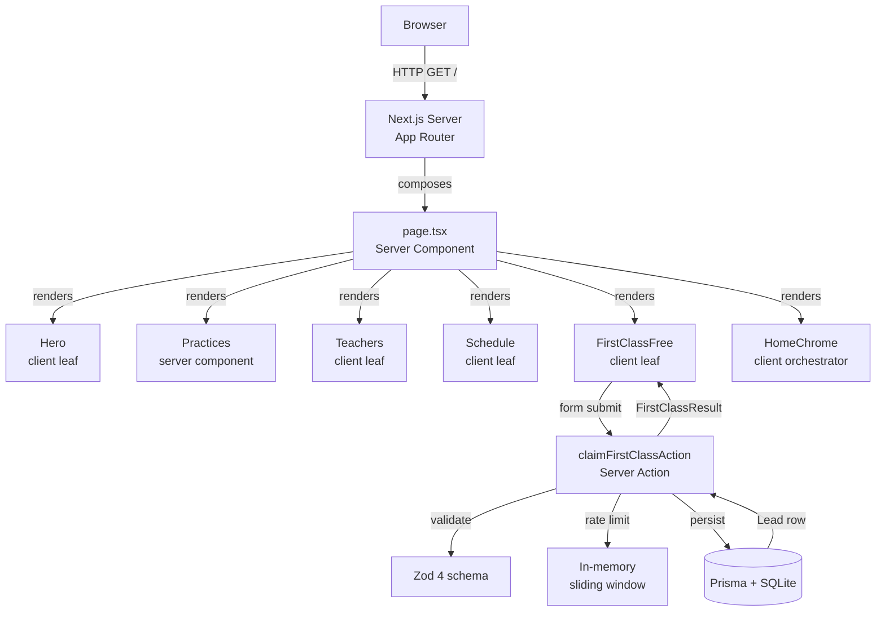

# Stillwater · A Yoga Studio in Cobble Hill


> Slow practice for fast lives. Eight mats to a room, one breath at a time.

A production-grade, enterprise-quality marketing & booking site for a boutique yoga studio — the antidote to high-intensity gym culture. Built faithful to a precise design north star: an **8-second breath cycle** on the hero (the literal cadence of a yogic inhale-exhale), a single **terracotta** accent used sparingly as punctuation, **Fraunces** set with optical sizing for the warmth of a real humanist serif, and a **linen-textured grain** laid over everything at 50% opacity so the cream feels like paper, not plastic.

---

## Overview

**What** — A single-page boutique yoga studio website with six editorial sections: Hero, Practices, Teachers, Schedule, First-Class-Free capture form, and Footer.

**Why** — Boutique-feeling pages die when the copy is generic. "Welcome to our yoga sanctuary" reads as a template; "between a bakery and a bookshop" reads as a real place. Every interaction (breath-cycle hero, typewriter teacher quotes, opt-in chime, expandable schedule rows) reinforces the brand promise of calm, intentional, grounded practice.

**How** — Next.js 16 App Router with Server Components by default, 5 client-component leaves for interactivity, Prisma + SQLite for lead capture, Zod 4 for validation, Radix UI primitives for the accordion, Web Audio API for the opt-in chime.

---

## Key Features

| ✨ | Feature | Description |
| --- | --- | --- |
| 🫁 | **8-second breath-cycle hero** | Ken Burns photo scales/translates on the same 8s cycle as a yogic inhale-exhale. Pauses when off-screen. |
| 📿 | **Mala-bead seat indicators** | Schedule availability shown as dot strings — reads like a mala bead, not a data dashboard. |
| ⌨️ | **Typewriter teacher quotes** | Hover (or tap, on touch) types out "why I teach" at 28ms/char with natural pauses on spaces, commas, em-dashes. |
| 📋 | **Expandable schedule rows** | Radix Accordion primitives, keyboard-accessible, with meaningful aria-labels per row. |
| 🔔 | **Opt-in perfect-fifth chime** | Two stacked triangle waves at A4 (440 Hz) + E5 (659.25 Hz) — the most consonant interval. Gated behind explicit user gesture. |
| 📨 | **First-Class-Free form** | `useActionState` + Server Action with Zod validation, honeypot, per-IP rate limiting, Prisma persistence. |
| 🌾 | **Linen grain overlay** | SVG noise at 50% opacity, multiply-blended — makes the cream feel like paper. |
| ♿ | **WCAG AAA accessibility** | Skip link, focus-visible rings, ARIA wiring, reduced-motion guard that *disables* animations (not slows). |

---

## Architecture

### Tech Stack

| Layer | Technology | Version | Purpose |
| --- | --- | --- | --- |
| Framework | Next.js | 16.1.3 | App Router, Turbopack, Server Components |
| UI | React | 19.0 | `useSyncExternalStore`, `useActionState`, no `forwardRef` |
| Language | TypeScript | 5.9 | Strict mode, `@/*` path alias |
| Styling | Tailwind CSS | 4.3 | CSS-first `@theme` config, no `tailwind.config.js` for app tokens |
| Components | shadcn/ui (New York) + Radix UI | latest | 50+ primitives, Radix accordion used directly |
| Fonts | Fraunces + Inter | via `next/font/google` | Humanist serif + UI sans pairing |
| Database | Prisma + SQLite | 6.19 | `Lead` model for form submissions (portable to Postgres) |
| Validation | Zod | 4.0 | Form schema, enum API (`{ message }` not `{ errorMap }`) |
| Audio | Web Audio API | browser-native | Opt-in chime, no library |
| Package manager | Bun | latest | `bun install`, `bun run dev` |

### Architectural Principles

1. **Server-first.** Only 5 leaves are client components: `Hero`, `Teachers`, `Schedule`, `FirstClassFree`, `HomeChrome`. Everything else renders on the server.
2. **Static content boundary.** Teachers, practices, and the weekly schedule live in `src/lib/data/*.ts` as `readonly` arrays — NOT in the database. Only `Lead` (form submissions) is in Prisma.
3. **One accent colour.** Terracotta `#b16a48` appears in exactly four places: section labels, hover underlines, sound toggle when active, form submit hover.
4. **Animations respect reduced-motion.** `prefers-reduced-motion` *disables* animations entirely (WCAG 2.3.3) — never slows them.
5. **Library discipline.** Use shadcn/ui + Radix when they exist. The Schedule accordion uses `@radix-ui/react-accordion` primitives directly.

### Request Flow



---

## File Hierarchy

```
📂 stillwater/
├── 📂 prisma/
│   └── 📄 schema.prisma                    # Lead model (first-class-free submissions)
├── 📂 public/
│   ├── 📄 logo.svg
│   └── 📄 robots.txt
├── 📂 src/
│   ├── 📂 app/
│   │   ├── 📂 api/
│   │   │   └── 📄 route.ts                 # Health check endpoint
│   │   ├── 📄 globals.css                  # @theme tokens, keyframes, reduced-motion guard
│   │   ├── 📄 layout.tsx                   # Fraunces + Inter fonts, skip link, metadata
│   │   └── 📄 page.tsx                     # Composes all 6 sections + chrome (SERVER)
│   ├── 📂 components/
│   │   ├── 📂 layout/                      # Persistent chrome
│   │   │   ├── 📄 BreathGuide.tsx          # Fixed bottom-left 8s breath orb
│   │   │   ├── 📄 Footer.tsx               # Ink-on-cream 4-column editorial
│   │   │   ├── 📄 HomeChrome.tsx           # Client orchestrator (sound state)
│   │   │   ├── 📄 LinenGrain.tsx           # SVG noise overlay (50% multiply)
│   │   │   ├── 📄 SoundToast.tsx           # Opt-in dialog + playChime()
│   │   │   └── 📄 Topbar.tsx               # Fixed nav, scroll-condense, sound toggle
│   │   ├── 📂 sections/                    # Homepage sections
│   │   │   ├── 📄 FirstClassFree.tsx       # useActionState + server action form
│   │   │   ├── 📄 Hero.tsx                 # 8s breath cycle + Ken Burns + scroll cue
│   │   │   ├── 📄 Practices.tsx            # 4-card editorial 2×2 grid
│   │   │   ├── 📄 Reveal.tsx               # IntersectionObserver fade-up wrapper
│   │   │   ├── 📄 Schedule.tsx             # Radix accordion + mala-bead dots
│   │   │   ├── 📄 SectionHead.tsx          # Label + title + lead shared header
│   │   │   └── 📄 Teachers.tsx             # Hover/click typewriter quotes
│   │   └── 📂 ui/                          # shadcn/ui primitives (50+ components)
│   ├── 📂 hooks/
│   │   ├── 📄 use-breath-cycle.ts          # 8s rAF loop (inhale/exhale counter)
│   │   ├── 📄 use-mobile.ts                # Breakpoint hook (scaffold)
│   │   ├── 📄 use-reduced-motion.ts        # useSyncExternalStore for prefers-reduced-motion
│   │   ├── 📄 use-reveal.ts                # IntersectionObserver fade-up
│   │   └── 📄 use-toast.ts                 # Toast hook (scaffold)
│   ├── 📂 lib/
│   │   ├── 📂 actions/
│   │   │   └── 📄 first-class.ts           # Server Action: Zod + honeypot + rate limit
│   │   ├── 📂 data/
│   │   │   ├── 📄 practices.ts             # 4 practices (Vinyasa/Yin/Restorative/Breathwork)
│   │   │   ├── 📄 schedule.ts              # 10 weekly classes + PREFERRED_DAYS enum
│   │   │   └── 📄 teachers.ts              # 3 teachers with "why I teach" quotes
│   │   ├── 📄 db.ts                        # Prisma client (global singleton)
│   │   └── 📄 utils.ts                     # cn() helper (clsx + tailwind-merge)
├── 📄 .env.example                         # DATABASE_URL template
├── 📄 .gitignore
├── 📄 AGENTS.md                            # Compact agent instructions
├── 📄 CLAUDE.md                            # Comprehensive project conventions
├── 📄 README.md                            # This file
├── 📄 bun.lock
├── 📄 components.json                      # shadcn/ui config (New York style)
├── 📄 eslint.config.mjs
├── 📄 next.config.ts                       # standalone output, picsum.photos remotePatterns
├── 📄 package.json
├── 📄 postcss.config.mjs                   # Only @tailwindcss/postcss (v4)
├── 📄 tailwind.config.ts                   # Empty scaffold default (tokens in globals.css)
└── 📄 tsconfig.json                        # strict, @/* alias, excludes audit folders
```

---

## Quick Start

### Prerequisites

- **Bun** ≥ 1.3 (or Node.js ≥ 20 with npm/pnpm)
- **Prisma CLI** (installed via `bun install`)

### Setup

```bash
# 1. Clone and install
git clone <your-repo-url> stillwater
cd stillwater
bun install

# 2. Configure environment
cp .env.example .env

# 3. Initialize the database
bunx prisma db push    # creates ./db/stillwater.db

# 4. Start the dev server
bun run dev
```

Open <http://localhost:3000>.

### Verify Setup

```bash
# Lint must pass
bun run lint
# Expected: (no output, exit 0)

# Typecheck must pass
bun run typecheck
# Expected: (no output, exit 0)

# Unit tests must pass
bun run test
# Expected: "Test Files  3 passed (3)" + "Tests  22 passed (22)"

# Dev server should report ready
tail -5 dev.log
# Expected: "✓ Ready in <1s" + "GET / 200 in <X>ms"
```

### Production Build

```bash
bun run build           # next build + copies static + public to standalone
bun run start           # NODE_ENV=production bun .next/standalone/server.js
```

---

## Environment Variables

| Variable | Required | Purpose | Example |
| --- | --- | --- | --- |
| `DATABASE_URL` | ✅ | SQLite connection string (relative path) | `file:./db/stillwater.db` |

That's the only env var. No `AUTH_SECRET`, no `NEXTAUTH_URL` — there is no auth. To migrate to Postgres, change `provider` in `prisma/schema.prisma` to `"postgresql"` and set `DATABASE_URL` to a `postgresql://` URL.

---

## Design System

### Color Tokens

| Token | Hex | Usage |
| --- | --- | --- |
| `--color-linen-50` | `#faf5ec` | Page background (brightest cream) |
| `--color-linen-100` | `#f4ede0` | Default cream background |
| `--color-linen-200` | `#efe6d4` | Card hover background |
| `--color-sand` | `#e3d5c1` | First-Class-Free section background |
| `--color-sand-deep` | `#c9b89e` | Sand-tinted dividers |
| `--color-sage` | `#8a9a87` | Available seat dots |
| `--color-sage-deep` | `#5d6e5a` | Italic emphasis in section titles |
| `--color-terracotta` | `#b16a48` | **PRIMARY accent** — labels, hover, focus |
| `--color-terracotta-deep` | `#8e4f33` | Hover state for terracotta |
| `--color-dusk-pink` | `#d4a5a0` | Soft secondary accent (radial blooms) |
| `--color-ink` | `#2c2620` | Headlines (15.8:1 contrast on linen-50) |
| `--color-ink-soft` | `#4a4036` | Body text (9.5:1) |
| `--color-ink-mute` | `#7a6e60` | Metadata (decorative only) |
| `--color-ink-line` | `rgba(44,38,32,0.14)` | Borders |

### Typography

| Role | Font | Weight | Tracking | Line-height |
| --- | --- | --- | --- | --- |
| Display (hero) | Fraunces | 300 | -0.025em | 0.95 |
| H1 (section titles) | Fraunces | 300 | -0.015em | 1.05 |
| H2 (card titles) | Fraunces | 400 | 0 | 1.2 |
| Body | Inter | 300 | 0 | 1.75 |
| Teacher quotes | Fraunces Italic | 300 | 0 | 1.65 |
| Metadata (labels, durations) | Inter | 500 | 0.16–0.32em uppercase | 1.2 |

### Animations

| Name | Duration | Easing | Use Case |
| --- | --- | --- | --- |
| `hero-breath` | 8s | `ease-in-out infinite alternate` | Hero photo scale + translate |
| `brand-breath` | 8s | `ease-in-out infinite` | Topbar brand mark dot |
| `breath-orb` | 8s | `ease-in-out infinite` | BreathGuide bottom-left orb |
| `scrollline` | 2.6s | `cubic-bezier(0.22, 1, 0.36, 1) infinite` | Hero scroll cue |
| `cursor-blink` | 1s | `steps(2) infinite` | Typewriter cursor |
| `sound-wave` | 1.4s | `ease-in-out infinite` | Sound toggle icon waves |

All animations are **disabled** (not slowed) under `prefers-reduced-motion: reduce` per WCAG 2.3.3.

---

## Testing

### Current state

**Vitest** is installed with **22 unit tests** covering the First-Class-Free validation logic (Zod schema, rate limiter, honeypot). Tests live in `src/tests/unit/`.

```bash
bun run test          # run once (CI-friendly)
bun run test:watch    # watch mode (local dev)
```

| Test file | Tests | Coverage |
| --- | --- | --- |
| `first-class.schema.test.ts` | 12 | Zod schema: happy path, name/email/notes/preferredDay validation |
| `first-class.rate-limit.test.ts` | 5 | Per-IP sliding window: 3/hour limit, 4th blocked, per-IP isolation |
| `first-class.honeypot.test.ts` | 5 | Bot detection: empty passes, non-empty rejected, whitespace rejected |

Manual verification via `agent-browser` is still used for visual/e2e checks:

```bash
agent-browser open http://localhost:3000/
agent-browser wait --load networkidle
agent-browser errors                          # must be empty
agent-browser console                         # must be empty (HMR connected is fine)
agent-browser snapshot -i                     # verify all 6 sections + form fields present
```

### Planned

- **`@testing-library/react` + `@testing-library/jest-dom`** for component tests on `FirstClassFree.tsx`, `Schedule.tsx`, `Hero.tsx`.
- **Playwright + @axe-core/playwright** for e2e + accessibility scans on every page.

---

## Troubleshooting

| Issue | Solution |
| --- | --- |
| `headers().get` runtime error in server action | Next.js 16 made `headers()` async. `await headers()` before calling `.get()`. See `src/lib/actions/first-class.ts`. |
| `Cannot find module 'drizzle-kit'` (or `@playwright/test`, `vitest`) during `bun run build` | An **orphan config file** at project root imports an uninstalled dependency. `next build` type-checks ALL `.ts`/`.tsx` files. Delete the orphan config (e.g. `drizzle.config.ts`, `playwright.config.ts`) or install the dep. |
| `Server Actions must be async functions` build error | A `'use server'` module exported a sync function. Move pure sync logic (Zod schemas, rate limiters) to a separate non-`'use server'` module. See `src/lib/first-class-validation.ts` for the pattern. |
| `cacheLife is not a function` in tests | Mock `next/cache`: `vi.mock("next/cache", () => ({ cacheLife: vi.fn() }))`. |
| Tailwind v4 utilities not generating | `postcss.config.mjs` must have ONLY `@tailwindcss/postcss`. Remove `autoprefixer` + `postcss-import`. |
| `set-state-in-effect` lint error | Use `useSyncExternalStore` for external state, NOT `useEffect` + `setState`. See `src/hooks/use-reduced-motion.ts` and `src/hooks/use-mobile.ts`. Do NOT silence the rule in `eslint.config.mjs`. |
| Zod 4 enum `errorMap` not found | API changed. Use `z.enum(values, { message: "..." })` instead of `{ errorMap: ... }`. See `src/lib/first-class-validation.ts`. |
| Schedule accordion doesn't expand | The shadcn `Accordion` wrapper injects a default chevron. We use `@radix-ui/react-accordion` primitives directly with our own `+` icon. Don't swap back. |
| Prisma `P2002` on form submit | Unique constraint on `email`. The server action handles this and returns a warm `DUPLICATE` message — not a bug. |
| Prisma migration drift (`prisma migrate dev` fails with "Drift detected") | Run `bun run db:reset` (dev only — destroys data), then `bun run db:migrate`. Never run `db:reset` in production. |
| Hydration mismatch on `useReducedMotion` | The hook uses `useSyncExternalStore` with `getServerSnapshot: () => false` — SSR-safe by design. If you still see mismatches, check for `typeof window === "undefined"` guards. |
| `DATABASE_URL` points to wrong database | A parent directory's `.env` may shadow the project's `.env`. Check with `bunx prisma migrate status`. The project's `.env` should have `DATABASE_URL="file:./db/stillwater.db"`. |
| `recharts` type errors after version bump | `recharts` was reverted from `^3.9.1` to `^2.15.4` because 3.x has breaking API changes. Do NOT bump to 3.x without updating `chart.tsx` (which was itself removed as unused). |

---

## Contributing

### TDD Flow (when tests are added)

```
RED → write a failing test
GREEN → write the minimum code to pass
REFACTOR → clean up without changing behavior
COMMIT → one cycle per commit
```

### Framework-specific conventions

- **React 19**: no `forwardRef` on new components — `ref` is a regular prop.
- **Tailwind v4**: CSS-first config in `globals.css` `@theme` block — no `tailwind.config.js` for app tokens.
- **Next.js 16**: `headers()` / `cookies()` / `params` / `searchParams` are `Promise<T>` — always `await`.
- **Zod 4**: `z.enum(values, { message })` not `{ errorMap }`.

### Pre-commit checklist

- [ ] `bun run lint` — 0 errors
- [ ] `bun run typecheck` — 0 errors
- [ ] `bun run test` — all tests pass
- [ ] `bun run build` — succeeds (run before PR, not every commit)
- [ ] No raw hex colours in components — use design tokens
- [ ] No `'use client'` on components that don't need it
- [ ] Every interactive element has a `:focus-visible` ring
- [ ] Animations respect `prefers-reduced-motion`
- [ ] No orphan config files at project root (see Troubleshooting)

---

## License

MIT © Stillwater Studio (fictional). Built with care.

---

## Related Docs

- **[`CLAUDE.md`](./CLAUDE.md)** — Comprehensive project conventions for Claude Code sessions.
- **[`AGENTS.md`](./AGENTS.md)** — Compact, high-signal instructions for AI coding agents.
