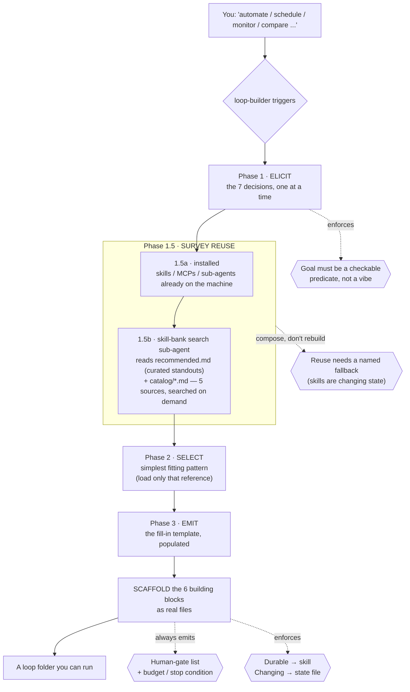
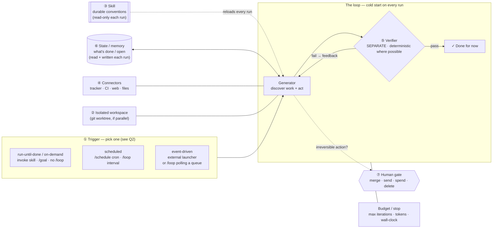
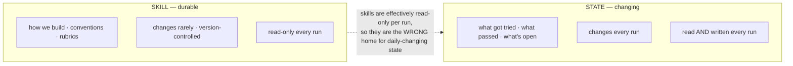

<div align="center">

# loop-builder

**A [Claude Code](https://docs.claude.com/en/docs/claude-code) skill that interviews you, then scaffolds a self-running agent loop — files and all.**

An unattended, scheduled, self-verifying agent workflow for whatever you describe.

[](https://docs.claude.com/en/docs/claude-code)
[](LICENSE)
[](#)
[](#the-loop-patterns-pick-the-simplest-that-works)
[](#the-six-building-blocks--what-each-means-and-why-its-there)

</div>

> Automate a recurring task, schedule an agent, set up monitoring or triage, run an agent overnight, or turn a manual workflow into a self-running one — **even if you never say the word "loop."**

### At a glance

| | |
|---|---|
| **What it does** | Turns "automate / schedule / monitor / compare …" into a real, runnable loop folder |
| **What you get** | A skill, a separate verifier, a state file, human-gates, and a trigger stub |
| **How you start** | Just describe the task — it triggers without the word "loop" |
| **What's built in** | A separate checker, a human gate on irreversible actions, and a budget/stop |
| **Install** | `git clone … ~/.claude/skills/loop-builder` ([jump ↓](#install)) |

---

## Why this exists

A loop is **not one long prompt**. It is a small self-running system in which an agent finds work, acts, gets graded against explicit criteria by a *separate* checker, and repeats — until the criteria pass or a budget runs out, without a human typing each turn.

The reason loops need engineering at all is one blunt fact:

> **The agent starts cold every run.** It forgets everything between runs. So conventions, commands, and "what's already done" must live *outside* the context window, on disk. **The agent forgets; the repo does not.**

Designing that system by hand each time is error-prone — people forget the verifier, leak mutable state into the wrong place, or ship a loop with no stop condition. `loop-builder` turns the design into a repeatable interview + scaffold so every loop you build has the parts that keep it safe and trustworthy.

---

## How the skill works

When it triggers, it runs in phases — **elicit → survey reuse → select → scaffold** — and never skips ahead, because a loop with a missing part is the failure mode, not a shortcut.

```
  describe          elicit            survey            select           scaffold
  the task    →   7 decisions   →   reuse what's   →   simplest     →   6 blocks as
                  one at a time     installed          pattern          real files
```



### The seven-question blueprint (Phase 1)

Every loop, whatever its purpose, comes down to seven decisions. Each maps to a building block:

| # | Decision | The question it answers |
|---|----------|-------------------------|
| 1 | **Goal (recursive)** | What *verifiable* condition means "done for now"? (a checkable predicate, e.g. "every P1 issue has an owner + plan comment" — not "keep the repo healthy") |
| 2 | **Trigger** | What fires it — a schedule, an event, or run-until-done? |
| 3 | **Discovery** | How does the agent *find* work each cycle? |
| 4 | **Action** | What may it *do*, through which tools? |
| 5 | **Verification** | Who checks the result, and against what? (a **separate** checker) |
| 6 | **State / memory** | Where does "what's done / what's open" persist *outside* the context? |
| 7 | **Human gates** | Which actions are irreversible and need approval first? |

(Plus two non-optional captures: the **durable knowledge** to put in the loop's skill, and the **budget/stop** condition.)

### Survey reuse before building (Phase 1.5)

Once the decisions are clear, the skill surveys reuse in two passes. **1.5a — installed:** it checks **what's already on the machine** that can *serve a block* rather than be rebuilt — an existing skill, MCP connector, or sub-agent. **1.5b — the skill-bank:** it dispatches a search sub-agent over the bundled `references/skill-bank/` — `recommended.md` (curated standouts) plus the comprehensive `catalog/*.md` listings across five upstream sources — to surface proven external prior art for any block the installed set doesn't already cover. This is the "compose blocks; don't reach for a framework you can't debug" principle applied to the build itself: the loop shouldn't re-derive a capability it already has, or hand-roll one the ecosystem has already solved. Findings from both passes are mapped to blocks (e.g. a different-model skill as the **verifier**, an MCP as a **connector**, a research agent as a **worker**), and anything wired in gets a **named fallback** — because an external skill is *changing* state you don't control, and a cold start must still work if it's missing or has changed.

---

## Loop architecture (what gets scaffolded)

The skill recommends the **simplest pattern that works** and then generates **six building blocks**. Here is the anatomy of a loop it produces:



### The six building blocks — what each means and why it's there

| # | Block | Its job | What breaks without it |
|---|-------|---------|------------------------|
| 1 | **Automation / scheduling** | The heartbeat: fires on a cadence, or runs until a condition holds | You have a one-off session, not a loop |
| 2 | **Isolated workspaces** (git worktrees) | Keep parallel agents from colliding on files | Parallel agents corrupt each other's work |
| 3 | **Skill** (`SKILL.md`) | Codify durable knowledge once so the loop stops re-deriving conventions | Every run is day one; knowledge never compounds |
| 4 | **Connectors** (MCP / tools) | Plug into real systems — read the tracker, open the PR, post to Slack | The agent *comments* instead of *operating* |
| 5 | **Sub-agents** | Split the maker from the checker; each gets fresh context | The worker grades its own homework |
| 6 | **Memory / external state** | Hold what's done and what's next, outside the context window | The cold-start agent repeats work and loses the thread |

### The one rule that runs through everything: durable vs. changing

Blocks 3 and 6 are constantly confused. They are not interchangeable — and putting mutable state inside a `SKILL.md` is the classic anti-pattern. `loop-builder` enforces this split in everything it generates:



### The loop patterns (pick the simplest that works)

The skill selects **one** and loads only its reference file (progressive disclosure):

| Pattern | Best when | "Done" is decided by |
|---------|-----------|----------------------|
| **ReAct + deterministic verifier** *(default)* | one workstream with a checkable result | a **program** — tests, schema check, predicate script |
| **Evaluator–optimizer** | criteria that need *judgement* | a **separate** evaluator grading against a rubric |
| **Orchestrator–workers** | work that *genuinely* parallelizes | an orchestrator synthesizing isolated workers |
| **Ralph** | a baseline / teaching device | a crude `while` loop against a fixed spec |

> Guidance the skill repeats: **compose the simplest blocks; don't reach for a framework you can't debug.** A single loop with a deterministic verifier beats an elaborate multi-agent system you can't reason about.

**Where it runs** is a separate choice from *what shape it is*. By default the skill scaffolds against Claude Code primitives (`/goal "<verifiable condition>"` for run-until-done, `/loop` for intervals — they combine into a self-terminating loop — plus worktrees, sub-agents, a bundled verifier, a state file). If you have a managed runtime such as **Claude Managed Agents** — whose native cron schedules, rubric "grader", memory, and review-before-it-lands gates map almost 1:1 onto the six blocks — the skill can target that instead. See [`references/deploy-claude-managed-agents.md`](references/deploy-claude-managed-agents.md) (kept behind an uncertainty flag, since it's a fast-moving beta).

---

## Why the implementation is shaped this way

A few deliberate choices, and the reasoning behind each:

- **`SKILL.md` body kept under ~500 lines, depth pushed into `references/`** — *progressive disclosure*. A loop pays token cost on every tick; skills preload only name + description and load the body when relevant, and load bundled references only when a specific pattern is chosen. This keeps the per-run context small while still carrying deep knowledge.
- **Deterministic verifiers live in `scripts/`, not in prose** — verification is the part that must be reliable, so it belongs in code with a binary exit status a scheduler can branch on. The bundled scripts are **red-green tested** (`scripts/tests/`): the test was written first, watched fail, then made to pass.
- **The verifier is always *separate* from the generator** — a model grading its own output is too generous. The maker/checker split is the single most important guardrail.
- **Every generated loop ships a human-gate list AND a budget** — prompt injection is unsolved, so a loop that reads issues/email/web ingests untrusted text every cycle; the durable defense is a *permanent human gate on irreversible actions* (merge, send, spend, delete). And a loop with no stop condition is a runaway cost. The skill refuses to call a loop "done" if either is missing.
- **Durable knowledge → the loop's own skill; changing progress → an external state file** — enforced in every artifact, never blurred.

---

## Repository layout

```
loop-builder/                  ← clone this into ~/.claude/skills/loop-builder
├── SKILL.md                   the skill: elicit → select → scaffold (< 500 lines)
├── references/
│   ├── loops-and-loop-engineering.md      the knowledge backbone (source of truth)
│   ├── pattern-react-deterministic-verifier.md
│   ├── pattern-evaluator-optimizer.md
│   ├── pattern-orchestrator-workers.md
│   ├── pattern-ralph.md
│   ├── deploy-claude-managed-agents.md     optional deploy target (beta; behind uncertainty flag)
│   └── skill-bank/                         catalog of borrowable external skills/plugins
│       ├── recommended.md                  curated standouts (preferred by the search sub-agent)
│       ├── catalog/                        comprehensive per-source listings (searched on demand)
│       ├── search-agent.md                 prompt for the skill-bank search sub-agent
│       └── sources.yml                     upstream sources + refresh/build procedure
├── scripts/
│   ├── verifier_template.sh               generic predicate runner (exits non-zero on fail)
│   ├── verify_no_p1_unassigned.sh         worked example (operates on gh-style JSON)
│   ├── lint_skill_bank_recommended.sh     validates the curated recommended-list schema
│   ├── refresh_skill_bank.sh              reports recommended-list drift vs upstream
│   ├── format_catalog.sh                  SKILL.md frontmatter -> catalog rows
│   ├── build_skill_bank_catalog.sh        generate per-source catalogs from upstream
│   ├── lint_skill_bank_catalog.sh         validates catalog schema
│   └── tests/                             red-green tests + fixtures
├── evals/evals.json           trigger tests (positive + negative) + per-eval expectations
├── docs/design-spec.md        how this skill itself was designed
├── LICENSE
└── README.md
```

---

## Install

```bash
# clone directly into your Claude Code skills directory
git clone https://github.com/AaronLPS/loop-builder.git ~/.claude/skills/loop-builder
```

Or drop it into a single project at `<project>/.claude/skills/loop-builder/`.

## Use

### 1. Build a loop

Just describe what you want — the skill is tuned to trigger without the word "loop":

- *"Help me automate triaging my GitHub issues every morning."*
- *"I want an agent to watch CI and open a fix PR when the nightly build breaks."*
- *"Set something up to review my inbox each morning and draft replies."*

It walks the seven questions, surveys reusable skills, recommends a pattern, and scaffolds the loop. Artifacts are split by durability, so the loop is **invocable by name**:

```
.claude/skills/<loop-name>/      ← DURABLE (installed as a skill, so /goal·/loop can invoke it)
├── SKILL.md         the loop's own conventions / rubric (read-only each run)
├── <verifier>       a SEPARATE check — script or evaluator sub-agent
├── HUMAN-GATES.md   irreversible actions that need approval + the budget/stop condition
└── TRIGGER.md       the exact /goal · /loop · /schedule line to start it

loops/<loop-name>/               ← CHANGING (run state, never a skill)
├── STATE.md         what's done / open (read + written each run)
└── ...              run inputs / outputs
```

The durable skill is installed under `.claude/skills/` for a concrete reason: `/goal` and `/loop` run a *prompt*, not a folder, so the loop is started by a prompt that **invokes its skill by name** — which only works if it's a discoverable skill. State stays in `loops/` because it changes every run.

### 2. Run the loop it scaffolds

The skill *designs and writes* the loop; you *run* it with Claude Code's native primitives (verify exact commands against current docs — they move fast):

1. **Skim what it generated** — especially `HUMAN-GATES.md` (what it will pause for) and `SKILL.md` (the rules it follows). Fill in any run input it asked for.
2. **Kick it off** using the stub in `TRIGGER.md`. `/goal` and `/loop` run a *prompt*, so the trigger has to **name the loop** — the prompt `run the <loop-name> loop` invokes the installed skill (and points it at its state folder):
   Match the launcher to the loop's trigger type — **don't default to `/loop`**, which is only for a recurring cadence:
   - **Run-until-done / on-demand** (you run it when there's new input — e.g. a comparison loop): `/goal "<the verifiable condition from question 1>"  run the <loop-name> loop`. **No `/loop`** — the trigger is you; it works until the condition holds or the budget is hit.
   - **Scheduled:** `/schedule "<cron>"` or `/loop <interval>  run the <loop-name> loop` (optionally with `/goal "<condition>"` to self-terminate each run).
   - **Event-driven** (fire when something appears): `/goal`/`/loop` can't *listen* for events — either poll with a low-frequency `/loop` that checks a queue and runs only on new work, or use a real external launcher (git hook, CI/webhook, file-watcher, or a managed runtime) to invoke it.
   - *If the loop wasn't installed as a skill,* the prompt must instead point at files: *"read `loops/<loop-name>/STATE.md` and the loop's `SKILL.md`, then …"*.
3. **What happens each run (cold start):** because the prompt invoked the loop's skill, the agent loads that `SKILL.md` (its conventions/rubric) and reads the run's `STATE.md` for what's already done — it doesn't rediscover them on its own; the **trigger prompt is what points it there**. Then it works through its connectors and the **separate verifier** checks the result. Pass → it records the outcome in `STATE.md` and stops; fail → it revises and loops; budget reached → it stops and flags the run.
4. **Human gates interrupt it.** When it reaches an irreversible action (merge, send, spend, delete, publish, push), it **pauses and asks you** instead of doing it. It never crosses those autonomously — that's the defense against acting on bad or injected input.
5. **Watch progress** in `STATE.md` (or the board/issues you chose) — it's written every run, so you can see what passed and what's open at a glance.
6. **Stop / resume freely.** Because state lives *outside* the context, you can cancel the `/loop` and restart later; it resumes from `STATE.md` rather than redoing finished work. It also self-stops at the verifiable goal or the budget (max iterations / tokens / wall-clock).

> Example: for "triage P1 issues every morning", the installed skill is
> `.claude/skills/issue-triage/`, and the stub is roughly
> `/goal "every open P1 issue has an assignee and a plan comment"  run the issue-triage loop`
> on a weekday-morning schedule — it triages until the condition holds, pausing for
> you on anything it's told to escalate rather than close. (Verify the exact
> schedule/command syntax against current docs.)

## Test the bundled scripts

```bash
bash scripts/tests/test_verifiers.sh
bash scripts/tests/test_skill_bank.sh
```

---

## Contributing

### Secret & PII scanning (pre-commit)

This is a public repo, so [`pre-commit`](https://pre-commit.com/) hooks guard
against committing things that shouldn't be public. **Install once per clone:**

```bash
pip install pre-commit        # or: pipx install pre-commit
pre-commit install            # wires the hooks into .git/hooks/pre-commit
```

After that, every `git commit` scans the staged changes and blocks:

| Check | Tool | Catches |
| --- | --- | --- |
| Secrets | [`gitleaks`](https://github.com/gitleaks/gitleaks) (`.gitleaks.toml`) | API keys, tokens, private keys |
| Local paths | `pygrep` hook | machine-local absolute home paths (`/home/<user>/...`) that leak a username |

Both checks also run server-side in
[`.github/workflows/secret-scan.yml`](.github/workflows/secret-scan.yml) on
every push/PR, so a `--no-verify` bypass still gets caught.

The config carries no personal data of its own; personal-email leakage is
handled by GitHub's email-privacy + push-protection settings. Allowlist a
gitleaks false positive with a trailing `# gitleaks:allow` comment or the
`[allowlist]` block in `.gitleaks.toml`; bump pinned hook versions with
`pre-commit autoupdate`.

---

## References & sources

The concepts here are not invented; they come from the loop-engineering literature, captured and graded in [`references/loops-and-loop-engineering.md`](references/loops-and-loop-engineering.md), which is the skill's knowledge backbone. Key sources:

**Primary / originating**
- **Addy Osmani — *Loop Engineering*** (addyosmani.com, June 2026): coined the term and the six-block anatomy.
- **Boris Cherny** (Head of Claude Code, Anthropic) and **Peter Steinberger** — the "write loops, not prompts" framing.

**Official (Anthropic)**
- *Equipping agents for the real world with Agent Skills* (anthropic.com/engineering) — Skills definition, progressive disclosure.
- [Agent Skills documentation](https://docs.claude.com) and the open standard (agentskills.io).
- *Building Effective Agents* (Anthropic) — the evaluator–optimizer and orchestrator–workers patterns.

**Peer-reviewed / academic**
- *Externalization in LLM Agents: Memory, Skills, Protocols and Harness Engineering* (arXiv) — the memory-vs-skills taxonomy.

**Secondary explainers** (blog-grade; treat specific numbers with caution)
- *The New Stack* — the prompt → context → harness → loop lineage.
- Geoffrey Huntley — the Ralph technique.

> **Uncertainty flag.** Loop engineering as a named practice is months old as of mid-2026. The core concepts (cold-start, six blocks, skills-vs-memory, maker/checker) are consistent across primary and official sources. **Specific product mechanics — `/goal`, `/loop`, `/schedule`, dynamic intervals — come mostly from secondary reporting and may have shifted; verify them against current Claude Code / Codex docs before relying on them.** The skill preserves this flag in everything it generates.

---

## License

[MIT](LICENSE) © 2026 AaronLPS. Fork it, improve it, make it yours.
